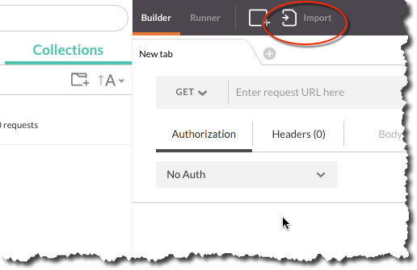
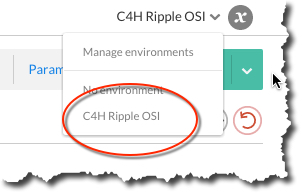
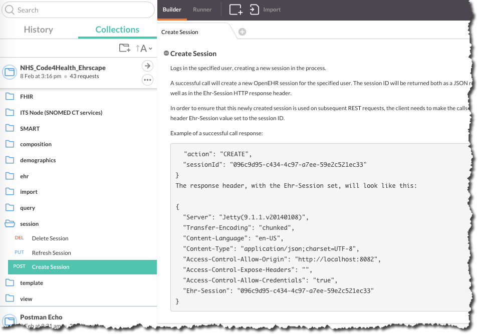
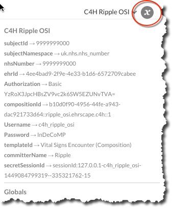
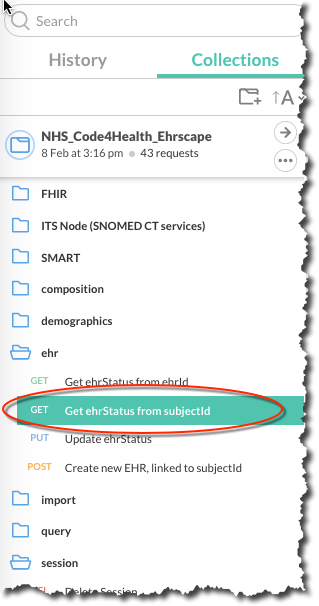
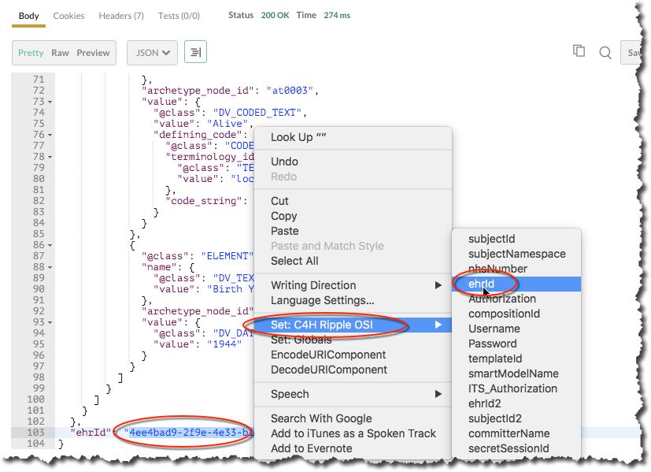
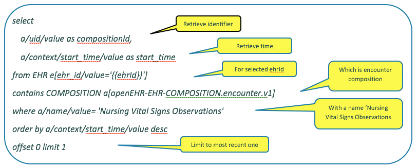
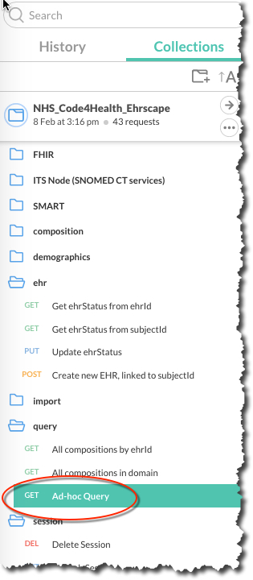

# Getting ready
This section describes a number of steps to get ready for working with Ehrscape.

## Download files from email
You will have received an email containing the collection and environment files to use with Postman. The first step is to download these files ready to then be imported into Postman.

Find `NHS_Code4Health_Ehrscape.json.postman_collection` in your email and download it to a folder of your choice (normally the Download folder).

Find `C4H Ripple OSI.postman_environment` in your email and download it to a folder of your choice (normally the Download folder).

## Import files into Postman
Open Postman and select `Import`

Locate your two save files and import them. You can either use the `Choose Files` option to import one at a time or drag and drop the files into the window

In the top right hand corner, change the environment to your environment (in the screenshot below that's the C4H Ripple OSI environment)

On the left hand side you can now see the collection files

## Navigate Postman
Click on the `NHS_Code4Health_Ehrscape collection` to reveal the folders, and then click on individual folders to expand and reveal the contents

Selecting one of the API calls displays more detail on the right hand side

Clicking on the ``x`` icon in the top right hand corner reveals a number of pre-set variables for your selected environment (again the C4H Ripple environment is used just as an example)

# Working with Ehrscape
We are now ready to start working properly with Ehrscape.

## Create Session
The first step is to create an openEHR session and retrieve the ``sessionId`` token. This allows subsequent API calls to be made without needing to login on each occasion.

Navigate to the `session` folder and highlight `Create Session` on the left, then click on the `Send` button.

Click the `Scroll to responses` button in the bottom right hand corner to display the response details.

The screenshot below shows the session Id which has been returned in the call.

## Get Patient EHR Identifier
The next step is to get the patient’s internal EHR identifier by sending their external identifier (in this case NHS Number). The ehrId is a unique string which, for security reasons, cannot be associated with the patient, if for instance their openEHR records were leaked.

Select `Get ehrStatus from subjectId` in the `ehr` folder and then click on the `Send` button.

Click on the `Scroll to responses` button in the bottom right hand corner to display the response details.

The JSON snippet below shows the ehrId for our dummy patient.

To store the returned ehrId as a pre-set for the selected environment, highlight the string in the response details, right mouse click, set the environment (*C4H Ripple OSI in this example*) and then select `ehrId` from the list of attributes.

## Retrieve a composition Id
Now that we have the patient’s EHR identifier, we can use it to locate and retrieve some clinical details. We use an Archetype Query Language (AQL) call to retrieve a list of the identifiers and dates of existing Nursing Vital Signs Observations Composition records. Compositions are document-level records which act as the container for all openEHR patient data.

The name/value of the Composition is the root name of the templates composition archetype (case-sensitive). In a real-world example we would query on other factors to ensure we had the ‘correct’ list.

The query we need to run in order to get the composition Id for the most recent vital signs composition for the selected patient is as follows:

Open the `query` folder and select `Ad-hoc query`

This is the query string in a format which can be copied and pasted:

> select
a/uid/value as compositionId,
a/context/start_time/value as start_time
from EHR e[ehr_id/value='{{ehrId}}']
contains COMPOSITION a[openEHR-EHR-COMPOSITION.encounter.v1]
where a/name/value= 'Nursing Vital Signs Observations'
order by a/context/start_time/value desc
offset 0 limit 1
